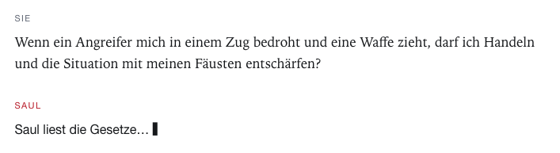
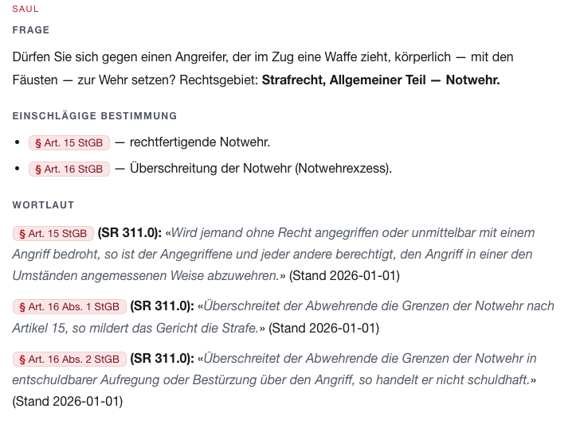
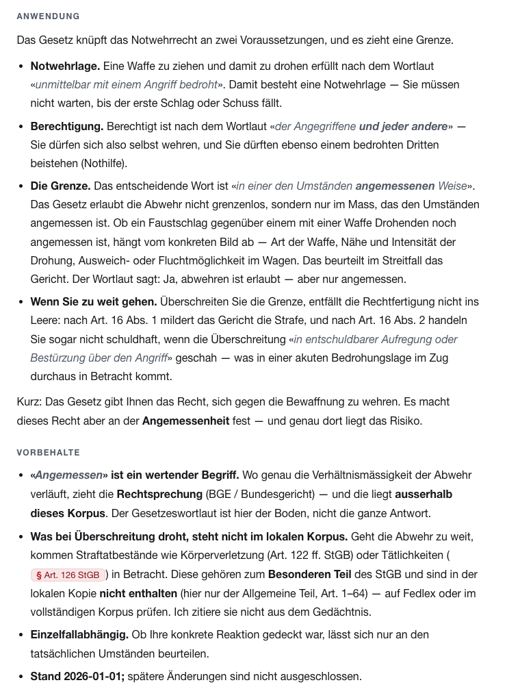
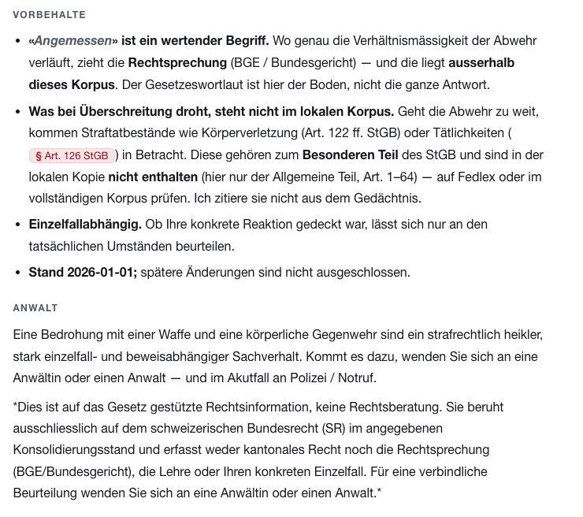

# Saul Swissman

Saul Swissman answers questions about Swiss federal law and quotes the statute for everything it says. Each
answer carries the article, the SR number, and the wording copied from the law. When the provision is not in
its corpus, it says so and points to Fedlex rather than answer from memory.

There is no application code. `SAUL.md` defines how Saul works, and Claude Code is the engine: it reads the
law in `corpus/`, finds the governing articles through the map in `register/`, and writes the answer. The
corpus is the source of truth. `register/` is a small index over it, rebuilt from the law itself, so one
question costs a few article reads rather than the whole 114 MB.

Saul quotes the statute instead of paraphrasing from memory; a statement without an article and a verbatim
quote does not get made. It does not invent a deadline, a fine, or a threshold, and "the statute gives no
period here" is a valid answer. It works only from federal law (SR), so it names the gap when a question
turns on cantonal law, court rulings (BGE), or doctrine, none of which the corpus contains. It points out the
related provision or deadline without predicting how a case would end.

## What an answer looks like

The screenshots below are a single exchange in the webview. Someone asks whether they may defend themselves
with their fists against an attacker who draws a weapon on a train. Saul names the area of law, quotes the
articles that govern it word for word, applies them to the situation, and marks where the corpus runs out.



Saul restates the question and names the area of law, then gives the governing provisions and quotes them
verbatim — each with its article, its SR number, and the consolidation date, copied from the law rather than
recalled.





The answer ends by naming what it cannot settle: the wording leaves "angemessen" to the courts, the offences
that come into play if the defence goes too far are in a part of the Criminal Code the local corpus does not
hold, and the whole thing is information from the statute rather than advice on the case.



## Start

```bash
# the webview — a white reading room, no terminal to manage:
./launch.sh web                  # → http://127.0.0.1:8788
#   ask a question; each citation in the answer opens the verbatim statute next to it.

# a Claude Code session in this folder — the engine itself:
./launch.sh                      # git-inits register/, offers to clone the full corpus
#   then ask, e.g.  "Darf mein Vermieter den Mietzins erhöhen?"
#   after cloning more law, say  "register"  to remap it
```

The seed ships four codes — BV and DSG complete, OR to Art. 361, StGB general part — so questions on
contracts, tenancy, data protection, and constitutional rights work offline. `./launch.sh` fetches the rest
of Swiss federal law from [legalize-ch](https://github.com/legalize-dev/legalize-ch).

The webview lives in `web/`. It renders the register, slices the article behind a citation, and runs Claude
Code. It decides nothing about the law, and deleting it changes nothing.

## What's where

```
SAUL.md       how Saul works — the whole program
register/     the map: index.md (router), locator.tsv (fast resolver, law → file → present articles),
              catalog.md (law → file), domains/ (topic → articles), build_index.py (rebuilds the locator)
corpus/ch/    the law, verbatim German federal statutes (seed vendored; launch.sh fetches the rest)
web/          the webview (serve.py + index.html)
```

## Limits

This is information drawn from the statute, not legal advice, and not a substitute for a lawyer. It rests on
federal law (SR) at the consolidation date shown with each quote, which does not rule out a later amendment,
and it does not cover cantonal law, court practice, or doctrine. The corpus is an early conversion and several
laws are incomplete: the Civil Code holds a fraction of its articles, the seed Criminal Code is the general
part only, and the OR seed ends at Art. 361 with gaps such as the ordinary-termination articles 334–336. Saul
names these edges when it reaches them. For anything binding, contested, or time-bound, consult a licensed
Anwältin or Anwalt.

## License

The Swiss federal legal texts in `corpus/` are official enactments and are not protected by copyright under
the Swiss Copyright Act (URG, SR 231.1; see Fedlex). Saul's own files are MIT — see `LICENSE`. The
authoritative source is [Fedlex](https://www.fedlex.admin.ch).
